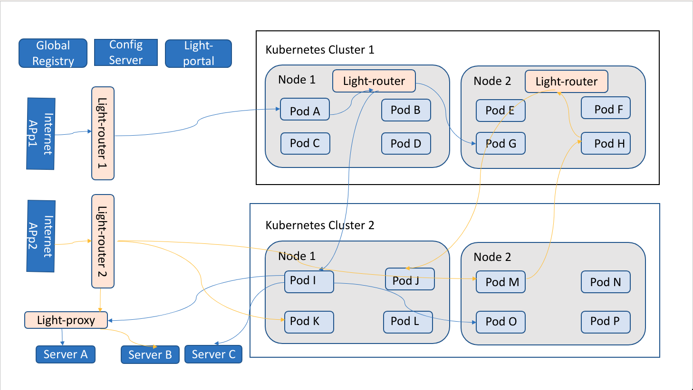

# light-mesh: Light Service Mesh
A service mesh implementation based on the light-proxy and light-router with SMI support

Light-mesh is a simple, light-weight, yet full-featured service mesh. It is designed as cloud/container-native running in your Kubernetes cluster, but not limited to the Kubernetes only. For large organizations, legacy APIs, services scattered across multiple cloud providers, B2B, Mobile, and Single Page applications all coexist, and we cannot expect customers to put everything into the same Kubernetes cluster. It supports the latest Service Mesh Interface specification [SMI](https://smi-spec.io) and can be managed from Solo.io [Service Mesh Hub](https://www.solo.io/servicemeshhub). 

### Flexible Service Mesh

Light-mesh does not use any sidecar container but handles routing proxy endpoints running on each node. The mesh controller runs in a dedicated server and handles all the configuration to the proxy nodes. The light-mesh supports two configuration options: light-config-server and SMI objects. Since we are not using sidecars, it does not modify your Kubernetes objects and does not alter your traffic without your knowledge. It works in a non-invasive fashion compare with other Service Mesh implementations. 

Most service mesh implementations are working only in a Kubernetes cluster. Light-mesh can be deployed inside a Kubernetes cluster, or across multiple Kubernetes clusters, or just on plain virtual servers, or across multiple cloud providers, or combination of all above. It is a total solution for large organizations that have too many legacy applications to be integrated. After all, you cannot expect a big organization will deploy all its applications into the same Kubernetes cluster. 

To support the flexibility, we have our controller and registry deployed outside of the Kubernetes cluster. All services, regardless of deploying in a Kubernetes cluster, VM, Unit Server, or Mainframe, can register as a global service with a unique service identifier. 

### Global service registry

Light-mesh uses a Consul cluster as the service registry and discovery. The cluster is installed at the data center or cloud provider level and can be even configured to support multi-data centers. 

### light-router

Light-router is responsible for traffic routing between services. Also, it handles the security for the consumer with OAuth 2.0 provider. 

### light-proxy

Light-proxy is similar to light-router but packaged in some different middleware handlers. It is responsible for bringing legacy services to the service mesh. For example, deploy in front of the Neo4j database or Tableau or Pega to provide services to the service mesh and handles the specific authentication and authorization requirement for the legacy services.  

### light-config-server

Light-4j has a lot of gateway cross-cutting concerns as middleware handlers, and they are all configured independently. Both light-router and light-proxy have its list of middleware handlers, and they are configured from light-config-server. The server also provides the configuration for microservices. 

### light-portal

Light-portal contains centralized infrastructure services for the entire service mesh, and these services are shared by all microservice instances, including light-proxy and light-router as they are just specifical microservices. 

