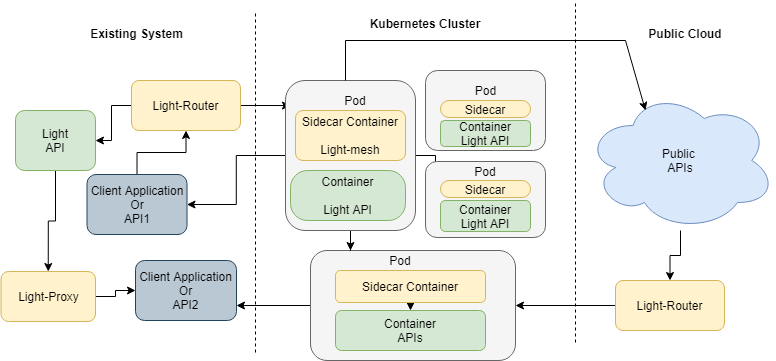

# light-mesh:  Light Service 

Light-mesh is a key component/service leveraging Microservice Sidecar Pattern in light-4j microservice platform. 

It is designed as cloud/container-native running in your Kubernetes cluster, but not limited to the Kubernetes only. For large organizations, legacy APIs, services scattered across multiple cloud providers, B2B, Mobile, and Single Page applications all coexist, and we cannot expect customers to put everything into the same Kubernetes cluster. It supports the latest Service Mesh Interface specification [SMI](https://smi-spec.io) and can be managed from Solo.io [Service Mesh Hub](https://www.solo.io/servicemeshhub). 

### Architecture diagram

### What Is a Sidecar Pattern

Segregating the functionalities of an application into a separate process can be viewed as a Sidecar pattern. The sidecar design pattern allows you to add a number of capabilities to your application without additional configuration code for third-party components.

In software architecture a sidecar attach to a parent application and extends/enhances its functionalities. A sidecar is loosely coupled with the main application.

In Kubernetes cluster environment, sidecar can be deployed as Sidecar container run in parallel with the main container in the pod.  

### Benefits of Using a Sidecar Pattern:

- Reduces the complexity in the microservice code by abstracting the common infrastructure-related functionalities to a different layer.
- Reduces code duplication in a microservice architecture since you do not need to write configuration code inside each microservice.
- Provide loose coupling between application code and the underlying platform.

### Flexible Service Mesh

- Light-mesh can be deployed as sidecar container run in parallel with the main container in the pod. 

The Light-mesh sidecar will proxy and router the ingress/egress traffic for the service in main container, and can delegate the Cross-Cutting Concerns handlers for the service in main container. 
 
- Light-mesh be deployed as separate service to a singer container pod. It handles routing proxy endpoints running on each node. 

The mesh controller runs in a dedicated server and handles all the configuration to the proxy nodes. The light-mesh supports two types of configuration options: light-config-server and SMI objects. Since we are not using sidecars, it does not modify your Kubernetes objects and does not alter your traffic without your knowledge. It works in a non-invasive fashion compare with other Service Mesh implementations. 

Most service mesh implementations are working only in a Kubernetes cluster. Light-mesh can be deployed inside a Kubernetes cluster, or across multiple Kubernetes clusters, or just on plain virtual servers, or across multiple cloud providers, or combination of all above. It is a total solution for large organizations that have too many legacy applications to be integrated. After all, you cannot expect a big organization will deploy all its applications into the same Kubernetes cluster. 

To support the flexibility, we have our controller and registry deployed outside of the Kubernetes cluster. All services, regardless of deploying in a Kubernetes cluster, VM, Unit Server, or Mainframe, can register as a global service with a unique service identifier. 

### light-mesh modules:

  - http-sidecar
  
    http-sidecar can be deployed as sidecar container/service to handle restful request/response related functionalities which include:
     
     - Package and deployed as separate module to handle Cross-Cutting Concerns for main container/service in the same pod. In this case, the main service only need care about the http request/response and business logic
     
     - Ingress traffic: client API request will come to sidecar service first, sidecar service act as a proxy to delegate light client features, which include, openapi schema validation, observability, monitoring, logging, JWT verify, etc. Then forward the request to main service.
      
     - Egress traffic: main service call sidecar service first for egress traffic; in this case, sidecar service act as a router to delegate light client features, which include service discovery, SSL handshake, JWT token management, etc. Then forward the request to server API.
  
  - kafka-sidecar
  
    //TODO

### light-mesh related light services

- Global service registry

Light-mesh uses a Consul cluster as the service registry and discovery. The cluster is installed at the data center or cloud provider level and can be even configured to support multi-data centers. 

- light-router

Light-router is responsible for traffic routing between services. Also, it handles the security for the consumer with OAuth 2.0 provider. 

- light-proxy

Light-proxy is similar to light-router but packaged in some different middleware handlers. It is responsible for bringing legacy services to the service mesh. For example, deploy in front of the Neo4j database or Tableau or Pega to provide services to the service mesh and handles the specific authentication and authorization requirement for the legacy services.  

- light-config-server

Light-4j have a lot of gateway cross-cutting concerns middleware handlers, and they are all configured independently. Both light-router and light-proxy have its list of middleware handlers, and they are configured from light-config-server. The server also provides the configuration for microservices. 

- light-portal

Light-portal contains centralized infrastructure services for the entire service mesh, and these services are shared by all microservice instances, including light-proxy and light-router as they are just specifical microservices. 

